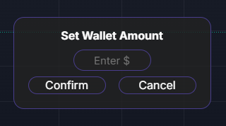

# Paper-Memes Chrome Extension

A Chrome Extension for [photon-sol.tinyastro.io](https://photon-sol.tinyastro.io) that overlays a menu on the website, enabling you to place paper trades on real pumpfun meme coins.

## Setup - Chrome Web Store
1.   **Go to the Chrome Web Store and get the extension**
   - link: [Chrome Web Store](https://chromewebstore.google.com/detail/paper-memes-to-the-moon/hgdfiddihagiidddmifmoknaglmpmdkd?utm_source=item-share-cb) 
3. **Create a Phantom Wallet**
   - Visit [Phantom Wallet](https://phantom.com/download) to create your wallet for free.
4. **Sign In to Photon-Sol**
   - Use your Phantom wallet to sign in at [photon-sol.tinyastro.io](https://photon-sol.tinyastro.io).
5. **Start Trading**

## Setup - From Github
1. **Alternatively download or Clone the Repository**
   - You may have to unzip it.
2. **Add the Extension to Chrome**
   - Go to `chrome://extensions` in your browser.
   - Enable "Developer Mode."
   - Click "Load unpacked" and select the folder where the repo is downloaded or cloned.
3. **Create a Phantom Wallet**
   - Visit [Phantom Wallet](https://phantom.com/download) to create your wallet for free.
4. **Sign In to Photon-Sol**
   - Use your Phantom wallet to sign in at [photon-sol.tinyastro.io](https://photon-sol.tinyastro.io).
5. **Start Trading**

## How It Works

### Trading

- **Select a Meme Coin:**
  - Click on any meme coin on the page.
  - The pop-up should appear, displaying trade options.

- **Buy & Sell:**
  - Use your wallet balance to buy and sell meme coins.
  
- **Profit or Loss Display:**
  - The percentage under your wallet shows your profit or loss since the last reset.
  - After buying a coin, the pop-up will show the value of your investment and the percentage of your gain/loss.

### Resetting

- **Reset Wallet Balance:**
  - To reset your balance, click on "Set Wallet" in the menu.
  - Enter any amount and press "Confirm"

### Settings

- **Trade Fee Settings:**
  - In the settings, you can adjust the fees for each trade.
  - Options available:
    - **Absolute Fee**
    - **Percentage Fee**

### Realistic features  
- **Trade Fee Settings:**  
  - In the settings, you can adjust the fees for each trade.  
  - Options available:  
    - **Absolute Fee**  
    - **Percentage Fee**  
- **1-second delay for buy and sell orders**  
- **Simulated slippage for very low liquidity**
